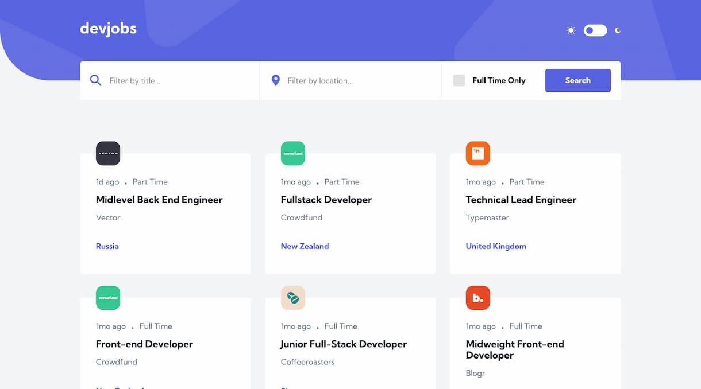

# Devjobs web app

This is a solution to the [Devjobs web app challenge on Frontend Mentor](https://www.frontendmentor.io/challenges/devjobs-web-app-HuvC_LP4l). Frontend Mentor challenges help you improve your coding skills by building realistic projects.

## Table of contents

- [Overview](#overview)
  - [The challenge](#the-challenge)
  - [Links](#links)
- [Built with](#built-with)
- [Author](#author)

## Overview

### The challenge

Users should be able to:

- View the optimal layout for each page depending on their device's screen size
- See hover states for all interactive elements throughout the site
- Be able to filter jobs on the index page by title, location, and whether a job is for a full-time position
- Be able to click a job from the index page so that they can read more information and apply for the job
- Have the correct color scheme chosen for them based on their computer preferences.

### Links

- [Live site](https://devjobs-svelte.netlify.app/)

## Built with

- Semantic HTML5 markup
- CSS custom properties
- Flexbox
- CSS Grid
- Mobile-first workflow
- [SvelteKit](https://kit.svelte.dev/) - JS library
- [Firebase](https://firebase.google.com/) - Backend

## Author

- Website - [nazifbara.com](https://www.nazifbara.com)
- Frontend Mentor - [@nazifbara](https://www.frontendmentor.io/profile/nazifbara)
- Twitter - [@nazifbara](https://www.twitter.com/nazifbara)
